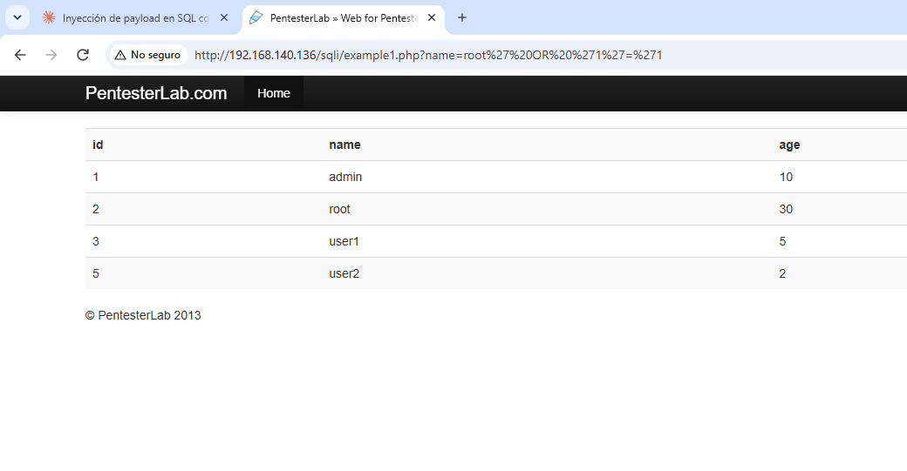
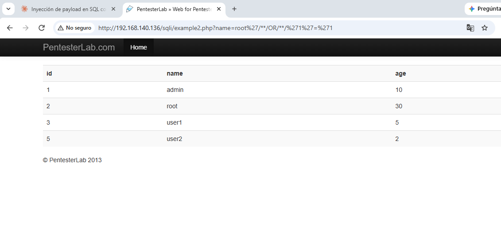
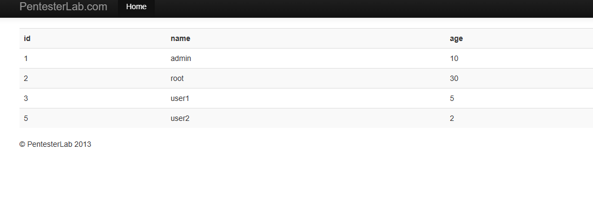
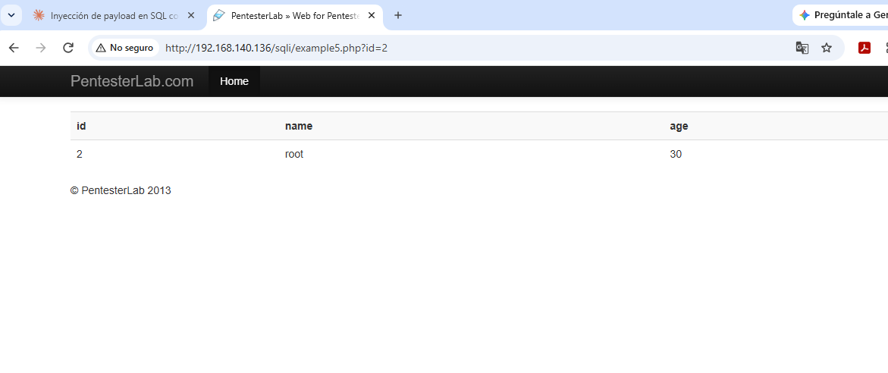
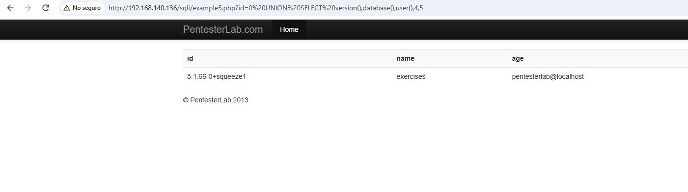
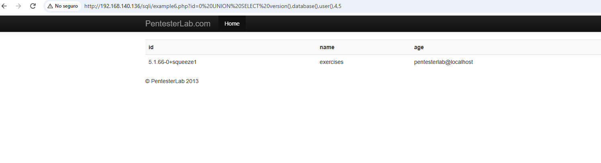
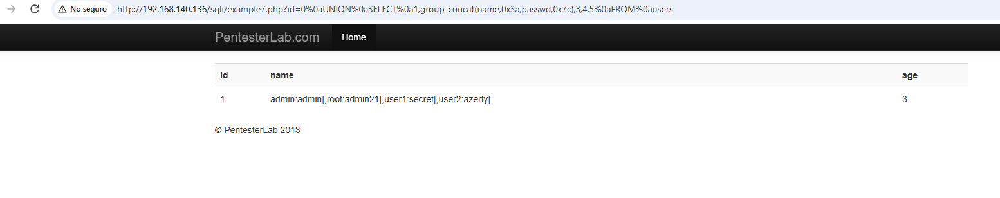
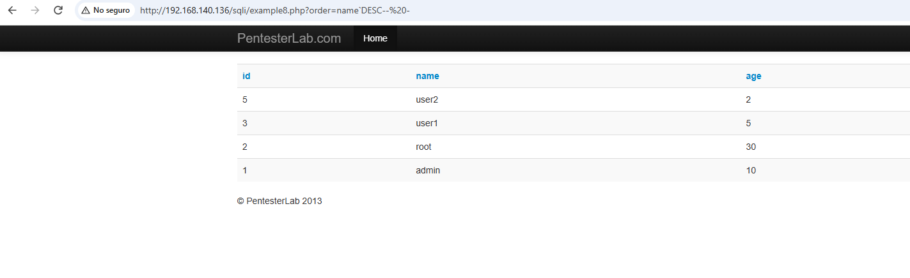
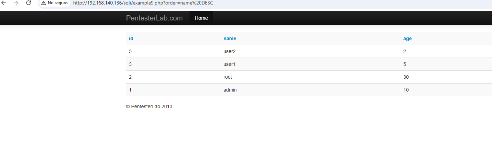

# SQL Injection Testing Report — Web for Pentester

**Lab:** Web for Pentester (PentesterLab) — SQL Injections module
**Author:** Juan Pablo Acevedo Araya
**Date:** 2026-10-01
**Target VM:** `http://192.168.140.136/`

> 🇪🇸 [Leer este informe en español](README.es.md)

## Introduction

This document collects the evidence and analysis of the 9 SQL Injection exercises from the Web for Pentester lab. For each example it documents the payload used, the full request, the observed result, whether the vulnerability was successfully exploited, and a short technical explanation of the root cause.

⚠️ **Note:** all tests were performed against an isolated lab virtual machine for educational purposes only.

---

## Example 1 — Basic tautology (GET `name`)

**Objective:** Classic tautology-based SQL injection (error-based / filter bypass) in the `name` GET parameter of `example1.php`.

- **Payload:** `name=root' OR '1'='1`
- **URL:** `http://192.168.140.136/sqli/example1.php?name=root' OR '1'='1`
- **Result:** The application returned ALL records from the `users` table (id 1-admin, 2-root, 3-user1, 5-user2) instead of only the `root` user.
- **Vulnerable?** Yes

**Technical explanation:** The `name` value is concatenated directly into the SQL query without sanitization or parameterized queries: `SELECT id, name, age FROM users WHERE name = '$name'`. Injecting `root' OR '1'='1` turns the `WHERE` clause into `name='root' OR '1'='1'`, and since `'1'='1'` is always true, the `OR` clause forces every row of the table to be returned, regardless of the requested name.

---

## Example 2 — Space-filter bypass

**Objective:** Tautology-based (error-based) SQL injection in the `name` GET parameter of `example2.php`, bypassing a server-side whitespace filter.

- **Payload:** `root'/**/OR/**/'1'='1`
- **URL:** `http://192.168.140.136/sqli/example2.php?name=root'/**/OR/**/'1'='1`
- **Result:** The Example 1 payload with normal spaces returned "ERROR NO SPACE", indicating a filter that blocks the space character. Replacing spaces with inline SQL comments (`/**/`) bypassed the filter and the application returned ALL records from `users`.
- **Vulnerable?** Yes

**Technical explanation:** The server attempts to mitigate SQL injection by filtering the space character (`" "`) in the `name` parameter, likely via `str_replace(" ", "", $input)` or a regex check. However, this filter is insufficient because MySQL allows multi-line comments (`/**/`) to act as a token separator without using a literal space. This shows that blacklisting specific characters is a weak defense against SQL injection; the correct fix is parameterized queries (prepared statements).

---

## Example 3 — Same filter, same bypass

**Objective:** Tautology-based (error-based) SQL injection in the `name` GET parameter of `example3.php`, with the same whitespace filter seen in `example2.php`.

- **Payload:** `root'/**/OR/**/'1'='1`
- **URL:** `http://192.168.140.136/sqli/example3.php?name=root'/**/OR/**/'1'='1`
- **Result:** Same behavior as example2: "ERROR NO SPACE" with normal spaces, and a successful bypass with `/**/`, returning every row from `users`.
- **Vulnerable?** Yes

**Technical explanation:** `example3.php` implements the same blacklisting validation as `example2.php`. Since the filtering logic is identical, the same bypass applies. This reinforces the earlier lesson: a filter based on blocking specific characters is not a robust defense, since SQL offers multiple equivalent syntactic ways to achieve the same result.

---

## Example 4 — Numeric injection without quotes

**Objective:** Tautology-based SQL injection in a numeric GET parameter (`id`) without quotes, in `example4.php`, with the same whitespace filter seen in previous examples.

- **Payload:** `-1/**/OR/**/1=1`
- **URL:** `http://192.168.140.136/sqli/example4.php?id=-1/**/OR/**/1=1`
- **Result:** The application returned ALL records from `users`, even though `id=-1` does not exist in the database.
- **Vulnerable?** Yes

**Technical explanation:** Unlike examples 1-3, here `id` is used in a numeric context without quotes: `SELECT id, name, age FROM users WHERE id = $id`. With no quotes to close, the attack is more direct: an `OR` operator followed by an always-true condition is enough. A negative (non-existent) id was used to clearly demonstrate that the returned rows come from the injected tautology, not from a real match.

---

## Example 5 — UNION-based, metadata extraction

**Objective:** UNION-based SQL injection in the numeric GET parameter `id` of `example5.php`, with a filter requiring the value to start with an integer digit (`die("ERROR INTEGER REQUIRED")` otherwise).

- **Payload:** `0 UNION SELECT version(),database(),user(),4,5`
- **URL:** `http://192.168.140.136/sqli/example5.php?id=0%20UNION%20SELECT%20version(),database(),user(),4,5`
- **Result:** Boolean-based injection was confirmed first (`id=2 and 1=1` vs `id=2 and 1=2`). Then, using `UNION SELECT`, the underlying table was found to have 5 columns. Finally, the following was extracted: MySQL version (`5.1.66-0+squeeze1`), database name (`exercises`), and connection user (`pentestlab@localhost`).
- **Vulnerable?** Yes

**Technical explanation:** The server validates that the value starts with a digit (blocking the `-` sign) but does not sanitize the rest of the value, allowing a full `UNION SELECT` clause to be injected. This shows that UNION-based injection can extract not only data from other tables, but also metadata from the database engine itself.

---

## Example 6 — UNION-based, no filters

**Objective:** UNION-based SQL injection in the numeric GET parameter `id` of `example6.php`, with no input filtering at all.

- **Payload:** `0 UNION SELECT version(),database(),user(),4,5`
- **URL:** `http://192.168.140.136/sqli/example6.php?id=0%20UNION%20SELECT%20version(),database(),user(),4,5`
- **Result:** Worked immediately, with no bypass needed, revealing the same server information as example5.
- **Vulnerable?** Yes

**Technical explanation:** The `id` parameter is concatenated directly into the query with no validation whatsoever. The fact that consecutive examples repeat the same underlying vulnerability while varying the filtering level progressively shows that no superficial validation can replace parameterized queries.

---

## Example 7 — Mass extraction with `group_concat`

**Objective:** UNION-based SQL injection with mass data extraction (`group_concat`) in the numeric GET parameter `id` of `example7.php`, with a filter requiring a leading digit and also blocking the space character.

- **Payload:** `0\nUNION\nSELECT\n1,group_concat(name,0x3a,passwd,0x7c),3,4,5\nFROM\nusers`
- **URL:** `http://192.168.140.136/sqli/example7.php?id=0%0aUNION%0aSELECT%0a1,group_concat(name,0x3a,passwd,0x7c),3,4,5%0aFROM%0ausers`
- **Result:** The payload with normal spaces returned "ERROR INTEGER REQUIRED". Replacing spaces with newlines (`%0a`) bypassed the filter. Using `group_concat`, all 4 credentials from the `users` table were extracted in a single request: `admin:admin`, `root:admin21`, `user1:secret`, `user2:azerty`.
- **Vulnerable?** Yes

**Technical explanation:** `example7.php` combines two controls seen before (numeric prefix + space filter), but the newline character (`\n`) serves the same syntactic purpose as a space without being the blocked character. The `group_concat()` function concatenates values from multiple rows into a single result cell, exfiltrating an entire table in a single HTTP request.

⚠️ Passwords are stored **in plain text** — an additional vulnerability independent from the SQL injection itself.

---

## Example 8 — `ORDER BY` injection (with backticks)

**Objective:** SQL injection in the `ORDER BY` clause, via the `order` GET parameter of `example8.php`, which directly controls the column name used for sorting.

- **Payload:** `` name`DESC-- - ``
- **URL:** `` http://192.168.140.136/sqli/example8.php?order=name`DESC--%20- ``
- **Result:** With the original URL (`order=name`), the order was ascending (admin, root, user1, user2). With the payload, the order was fully reversed (user2, user1, root, admin).
- **Vulnerable?** Yes

**Technical explanation:** The `order` parameter is concatenated as a column name inside `ORDER BY`, likely wrapped in backticks: `` ORDER BY `$order` ``. Injecting `` name`DESC-- - `` closes the backtick, appends `DESC` to reverse the order, and comments out the rest. This type of injection, less well-known than `WHERE`-based ones, can also be used to blindly exfiltrate data on certain database engines.

---

## Example 9 — `ORDER BY` injection (no quoting)

**Objective:** SQL injection in the `ORDER BY` clause via the `order` GET parameter of `example9.php`, with no quotes or backticks wrapping the value in the original query.

- **Payload:** `name DESC`
- **URL:** `http://192.168.140.136/sqli/example9.php?order=name%20DESC`
- **Result:** The order was reversed (user2, user1, root, admin) without needing to close any quote.
- **Vulnerable?** Yes

**Technical explanation:** Unlike `example8.php`, here the parameter is concatenated in plain text inside `ORDER BY`: `ORDER BY $order`. Any valid SQL keyword after the column name executes directly, with no syntactic barrier to evade. This is the simplest and most direct form of `ORDER BY` injection.

---

## Overall conclusion

Across the 9 exercises, the main SQL injection techniques were covered:

| # | Technique | Injection point | Filter present |
|---|---|---|---|
| 1 | Tautology (error-based) | `name` (string) | None |
| 2-3 | Tautology + space-filter bypass | `name` (string) | Space blocked |
| 4 | Numeric tautology | `id` (numeric) | Space blocked |
| 5 | UNION-based | `id` (numeric) | Mandatory numeric prefix |
| 6 | UNION-based | `id` (numeric) | None |
| 7 | UNION-based + `group_concat` | `id` (numeric) | Numeric prefix + space |
| 8-9 | `ORDER BY` injection | `order` (column name) | Backticks (ex. 8) / None (ex. 9) |

**Main lesson:** in every case, the root cause is **direct concatenation of user input into an SQL query**. No filtering mechanism based on blocking specific characters or words (blacklisting) was sufficient, because SQL offers multiple equivalent syntactic ways to achieve the same result (comments, newlines, functions, etc.).

**Recommendation:** the only robust mitigation is the use of **parameterized queries / prepared statements**, together with:
- Strict whitelist validation when user input controls structural elements of the query (such as column names in `ORDER BY`).
- Principle of least privilege for the application's database user.
- Never exposing raw database error messages to the end user.
- Never storing passwords in plain text (use bcrypt, Argon2, etc.).
